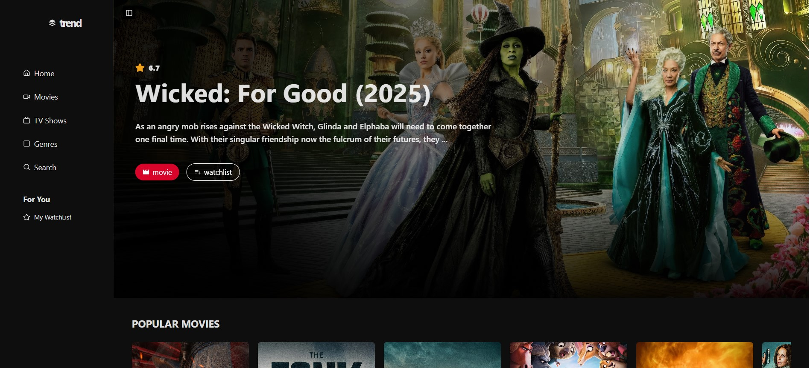

# TMDB Movie Discovery App 🎬

A responsive movie discovery web application built using **The Movie Database (TMDB) API**.  
Users can explore trending movies, view detailed movie information, and browse cast details in an intuitive interface.

🔗 **Live Demo:** https://tmdb-movie-discovery.netlify.app/

---

## ✨ Features

- Browse trending and popular movies
- View detailed movie information (overview, release date, rating, etc.)
- Explore cast and crew details
- Responsive design for desktop and mobile
- Clean and user-friendly UI

---

## 🛠️ Tech Stack

- **Frontend:** React, TypeScript, Shadcn
- **API:** The Movie Database (TMDB) API  
- **Deployment:** Netlify

---

## 📸 Screenshots

